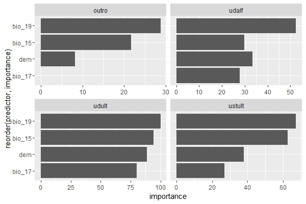

# Classification 
## Loading packages
```{r message=FALSE, warning=FALSE}
pkg <- c("hydroGOF", "caret", "sf", "stringr", "geobr", "readxl", "dplyr", "terra", "parallelly", "parallel", "doParallel", "DescTools", "tidyr")
sapply(pkg, require, character.only = T)
```

## Cleaning the environment (removing objects and previously loaded packages)
```{r}
rm(list = ls())  
gc()
```

## Parameterization
```{r message=FALSE, warning=FALSE}
path_raiz <- "C:/R/pedometrics/classification/"

setwd(path_raiz)

# Number of repetitions
nruns <- 100

# Number of folds in RFE (for cross-validation)
fold_rfe <- 10

# Number of repetitions for RFE execution (> 1 for repeated cross-validation)
rep_rfe <- 1

# Metric used for model optimization
metric_otm <- "Kappa"

# Number os subsets of covariates in the RFE 
size_rfe <- seq(2, 107, 2)

# Number of tries for hyperparameter tuning in the RFE
tn_length_rfe <- 2

# Number of tries for hyperparameter tuning in the modelling
tn_length <- 10

# Number of folds in the modelling (for cross-validation)
fold_model <- 10

# Number of repetitions for Modelling 
rep_model <- 10

# Performance loss tolerance to select the best subset of predictors (in %)
tol_per <- 2

# Used models (see available models in caret documentation)
models <- c("rf")

# Selecting the name of the target variable to be modeled
varsy <- read.csv2("./extract_xy/class_yx.csv") %>% 
  names() %>% 
  .[1]

# Defining the names of factor predictors
varfact <- c("curvature_classification", "geology", "geomorphons", "landforms_tpi_based", "surface_specific_points", "rookeries",  "terrain_surface_classification_iwahashi", "valley_idx", "vegetation") %>% sort()

# Setting a cluster of cores for parallel running
cl <- parallel::makeCluster(15)
cl <- parallelly::autoStopCluster(cl)
```

## Code execution
```{r eval=FALSE, message=FALSE, warning=FALSE, include=TRUE}
for (i in seq_along(models)) {
  
  tmodel <- Sys.time()
  
  for (j in seq_along(varsy)) {
    
    # Results folder
    path_results <- "C:/R/pedometrics/classification/results/"
    
    tvar <- Sys.time()
    
    # Loading the dataset (table) with samples and covariates values
    dfbase <- read.csv2("./extract_xy/class_yx.csv")
    
    # Creating a dataframe to store performance results
    dfperf <- data.frame(model = integer(nruns),
                         var = integer(nruns),
                         n_train = integer(nruns),
                         kappa_train = integer(nruns),
                         accuracy_train = integer(nruns),
                         sensitivity_train = integer(nruns),
                         specificity_train  = integer(nruns),
                         precision_train = integer(nruns),
                         recall_train = integer(nruns),
                         balanced_accuracy_train = integer(nruns),
                         f1_train = integer(nruns),
                         n_test = integer(nruns),
                         kappa_test = integer(nruns),
                         accuracy_test = integer(nruns),
                         sensitivity_test = integer(nruns),
                         specificity_test  = integer(nruns),
                         precision_test = integer(nruns),
                         recall_test = integer(nruns),
                         balanced_accuracy_test = integer(nruns),
                         f1_test = integer(nruns))
    
    var <- varsy[j]
    
    # Creating a folder to store individual model results
    if (!dir.exists(paste0(path_results, models[i]))) {
      dir.create(paste0(path_results, models[i]))
    }
    
    
    if (!dir.exists(paste0(path_results, models[i], "/", var))) {
      dir.create(paste0(path_results, models[i], "/", var))
    }
    
    path_results <- paste0(path_results, models[i], "/", var, "/")
    
    if (!dir.exists(paste0(path_results, "select"))) {
      dir.create(paste0(path_results, "select"))
    }
    
    if (!dir.exists(paste0(path_results, "select/cor"))) {
      dir.create(paste0(path_results, "select/cor"))
    }
    
    if (!dir.exists(paste0(path_results, "select/rfe"))) {
      dir.create(paste0(path_results, "select/rfe"))
    }
    
    if (!dir.exists(paste0(path_results, "select/rfe/metric"))) {
      dir.create(paste0(path_results, "select/rfe/metric"))
    }
    
    if (!dir.exists(paste0(path_results, "select/rfe/select"))) {
      dir.create(paste0(path_results, "select/rfe/select"))
    }
    
    if (!dir.exists(paste0(path_results, "select/rfe/metric/", var))) {
      dir.create(paste0(path_results, "select/rfe/metric/", var))
    }
    
    if (!dir.exists(paste0(path_results, "select/rfe/select/", var))) {
      dir.create(paste0(path_results, "select/rfe/select/", var))
    }
    
    if (!dir.exists(paste0(path_results, "performance"))) {
      dir.create(paste0(path_results, "performance"))
    }
    
    if (!dir.exists(paste0(path_results, "performance/csv"))) {
      dir.create(paste0(path_results, "performance/csv"))
    }
    
    if (!dir.exists(paste0(path_results, "performance/imp_pred"))) {
      dir.create(paste0(path_results, "performance/imp_pred"))
    }
    
    if (!dir.exists(paste0(path_results, "performance/imp_pred/", var))) {
      dir.create(paste0(path_results, "performance/imp_pred/", var))
    }
    
    if (!dir.exists(paste0(path_results, "img"))) {
      dir.create(paste0(path_results, "img"))
    }
    
    dy <- dfbase %>% dplyr::select({var})
    dx <- dfbase %>% dplyr::select(-{varsy})
    
    dyx_sel <- cbind(dy, dx) %>% 
      filter(!!sym(var) > 0) %>% 
      na.omit()
    
    dyx_sel <- dyx_sel %>% 
      mutate_at(.vars = vars(contains(c(var, varfact))), as.factor)
    
    # Removing predictors with a near zero variance
    dyx_sel <- dyx_sel %>% 
      dplyr::select(-one_of(nearZeroVar(., names = T)))
    
    # Removing predictors by spearman correlation > |0.95|
    mcor <- dyx_sel %>% dplyr::select(-one_of(var)) %>%
      dplyr::select_if(is.numeric) %>% 
      cor(method = "spearman")
    
    fc <- findCorrelation(mcor, cutoff = 0.95, names = T)
    
    print(fc)
    
    data.frame(fc) %>% 
      `colnames<-`(paste0("rem_cor_", var)) %>% 
      write.csv2(file = paste0(path_results, "select/cor/", var,
                               "_cor", ".csv"), row.names = F)
    
    dyx_sel <- dyx_sel %>% dplyr::select(-one_of(fc))
    
    set.seed(666)
    nseed <- sample(1:100000, nruns)
    
    # Creating a list with the trained models
    lmodel <- list()
    lpredimp <- list()
    
    lrfepred <- list()
    lrferes <- list()
    lconf_matrix_train  <- list()
    lconf_matrix_test <- list()
    
    for (n in 1:nruns) {
      
      trun <- Sys.time()
      
      status_run <- paste(trun, models[i], var, "run", n, "missing", nruns - n)
      
      print(status_run)
      
      set.seed(nseed[n])
      # Splitting the dataset into training set (80%) and testing set (20%)
      vf <- createDataPartition(dyx_sel[, var], p = 0.8, list = F)
      
      train <- dyx_sel[vf,]
      
      test <- dyx_sel[-vf,]
      
      registerDoParallel(cl)
      
      set.seed(nseed[n])
      
      # Recursive Feature Elimination
      rfe_ctrl <- rfeControl(method = "repeatedcv", 
                             repeats = rep_rfe,
                             number = fold_rfe,
                             verbose = F)
      
      set.seed(nseed[n])
      
      model_ctrl <- trainControl(method = "repeatedcv", 
                                 number = fold_rfe,
                                 repeats = rep_rfe,
                                 savePredictions = T)
      
      formu <- as.formula(paste(var, "~ ."))
      
      set.seed(nseed[n])
      
      rfe_fit <- rfe(form = formu,
                     data = train,
                     sizes = size_rfe,
                     method = models[i],
                     metric = metric_otm,
                     trControl = model_ctrl,
                     tuneLength = tn_length_rfe,
                     rfeControl = rfe_ctrl,
                     maximize = ifelse(metric_otm %in% c("RMSE", "MAE"),
                                       FALSE, TRUE))
      
      print(rfe_fit)
      
      print("-----------------------------------------------------------------")
      
      status_rfe <- paste("RFE run", models[i], var, n, round(Sys.time() - trun, 2),
                          units(Sys.time() - trun))
      
      print(status_rfe)
      
      # Applying the loss of performance criterion 
      lrferes[[n]] <- rfe_fit$result
      
      pick <- caret::pickSizeTolerance(x = lrferes[[n]],
                                       metric = metric_otm,
                                       tol = tol_per,
                                       maximize = ifelse(
                                         metric_otm %in% c("RMSE", "MAE"),
                                         FALSE, TRUE))
      
      lrfepred[[n]] <- rfe_fit$optVariables[1:pick]
      
      print(paste("select", pick))
      
      print("-----------------------------------------------------------------")
      
      # Unique names for categorical variables
      if (grepl(x = paste(lrfepred[[n]], collapse = " "),
                pattern = paste(varfact, collapse = "|"))) {
        
        for (h in seq_along(varfact)) {
          cf <- data.frame(vsel_rfe = lrfepred[[n]]) %>% 
            mutate(vsel_rfe = str_replace(vsel_rfe, paste0(".*", varfact[h], ".*"),
                                          varfact[h])) %>% 
            filter(!str_detect(vsel_rfe, paste(varfact[-h], collapse = "|"))) %>% 
            unique() %>% 
            pull()
          
          if (h == 1){
            
            cff <- cf
            
          } else {
            
            cff <- c(cff, cf)
            
          }
        }
        
        lrfepred[[n]] <- unique(cff)
        
      }
      
      write.csv2(data.frame(lrferes[[n]]),
                 file = paste0(path_results, "select/rfe/metric/", var,
                               "/RFE_", "ACCURACY_KAPPA_", n, ".csv"), row.names = F)
      
      write.csv2(data.frame(pred_sel = lrfepred[[n]]),
                 file = paste0(path_results, "select/rfe/select/", var,
                               "/RFE_", "pred_sel_", n, ".csv"), row.names = F)
      
      # Taking variables chosen by RFE for model training
      dfselrfe <- train %>% dplyr::select({var}, one_of(lrfepred[[n]]))
      
      # Model training
      set.seed(nseed[n])
      model_ctrl <- trainControl(method = "repeatedcv", 
                                 number = fold_model,
                                 repeats = rep_model,
                                 savePredictions = T)
      
      formu <- as.formula(paste(var, "~ ."))
      
      registerDoParallel(cl)
      
      set.seed(nseed[n])
      
      model_fit <- train(form = formu,
                         data = dfselrfe,
                         metric = metric_otm,
                         importance = T,
                         method = if (models[i] %in% c("gbm_custom")){
                           get(models[i])
                         } else {
                           models[i]
                         }, 
                         trControl = model_ctrl,
                         tuneLength = tn_length,
                         # importance = T,
                         maximize = ifelse(
                           metric_otm %in% c("RMSE", "MAE"), FALSE, TRUE))
      
      print(model_fit)
      
      print("-----------------------------------------------------------------")
      
      status_model <- paste(model_fit[["modelInfo"]][["label"]], var, n,
                            round(Sys.time() - trun, 2),
                            units(Sys.time() - trun))
      
      print(status_model)
      
      print("-----------------------------------------------------------------")
      
      lmodel[[n]] <- model_fit
      
      # Calculating performance metrics
      pr_train <- getTrainPerf(lmodel[[n]])
      
      pr_test <- predict(lmodel[[n]], test) %>% 
        postResample(pred =  ., obs = test[, var])
      
      predict_train <- predict(lmodel[[n]], train)
      
      lconf_matrix_train[[n]] <- confusionMatrix(table(predict_train, train[, var]),
                                                 mode = "everything")
      
      predict_test <- predict(lmodel[[n]], test)
      
      lconf_matrix_test[[n]] <- confusionMatrix(table(predict_test, test[, var]),
                                                mode = "everything")
      
      # Calculating importance of predictors
      pred_imp <- varImp(lmodel[[n]])
      
      lpredimp[[n]] <- data.frame(pred_imp[1]) %>% 
        mutate(predictor = row.names(.)) %>%
        gather(key = "class",
               value = "importance", -predictor) %>% 
        relocate(class, predictor) %>% 
        mutate(class = gsub("importance.", "", class))
      
      # Plotting predictor importance
      gg <-  ggplot(lpredimp[[n]], aes(y = reorder(predictor, importance), x = importance)) +
        geom_col() +
        facet_wrap(~class, scales = "free_x")
      
      print(gg)
      
      write.csv2(lpredimp[[n]],
                 paste0(path_results, "performance/imp_pred/", var, "/",
                        "imp_pred_", n, ".csv"), row.names = F)
      
      # Filling the dataframe with the performances of models
      dfperf$model[n] <- lmodel[[n]][["modelInfo"]][["label"]]
      dfperf$var[n] <- var
      dfperf$n_train[n] <- nrow(train)
      dfperf$n_test[n] <- nrow(test)
      dfperf$kappa_train[n] <- pr_train$TrainKappa
      dfperf$accuracy_train[n] <- pr_train$TrainAccuracy
      dfperf$sensitivity_train[n] <- mean(lconf_matrix_train[[n]][["byClass"]][,"Sensitivity"], na.rm = T)
      dfperf$specificity_train[n] <- mean(lconf_matrix_train[[n]][["byClass"]][,"Specificity"], na.rm = T)
      dfperf$precision_train[n] <- mean(lconf_matrix_train[[n]][["byClass"]][,"Precision"], na.rm = T)
      dfperf$recall_train[n] <- mean(lconf_matrix_train[[n]][["byClass"]][,"Recall"], na.rm = T)
      dfperf$balanced_accuracy_train[n] <- mean(lconf_matrix_train[[n]][["byClass"]][,"Balanced Accuracy"], na.rm = T)
      dfperf$f1_train[n] <- mean(lconf_matrix_train[[n]][["byClass"]][,"F1"], na.rm = T)
      dfperf$kappa_test[n] <- pr_test["Kappa"]
      dfperf$accuracy_test[n] <- pr_test["Accuracy"]
      dfperf$sensitivity_test[n] <- mean(lconf_matrix_test[[n]][["byClass"]][,"Sensitivity"], na.rm = T)
      dfperf$specificity_test[n] <- mean(lconf_matrix_test[[n]][["byClass"]][,"Specificity"], na.rm = T)
      dfperf$precision_test[n] <- mean(lconf_matrix_test[[n]][["byClass"]][,"Precision"], na.rm = T)
      dfperf$recall_test[n] <- mean(lconf_matrix_test[[n]][["byClass"]][,"Recall"], na.rm = T)
      dfperf$balanced_accuracy_test[n] <- mean(lconf_matrix_test[[n]][["byClass"]][,"Balanced Accuracy"], na.rm = T)
      dfperf$f1_test[n] <- mean(lconf_matrix_test[[n]][["byClass"]][,"F1"], na.rm = T)
      
      write.csv2(dfperf, row.names = F, paste0(
        path_results, "performance/csv/", var, "_performance", ".csv"))
      
      save.image(paste0(path_results, "img/", var, ".RData"))
      
      gc()
    }
    
    # save select rfe -------------------------------------------------
    n_obs <- sapply(lrfepred, length)
    
    seq.max <- seq_len(max(n_obs))
    
    rfe_pred_full <- as.data.frame(sapply(lrfepred, "[", i = seq.max))
    
    write.csv2(rfe_pred_full, row.names = F,
               file = paste0(
                 path_results, "select/rfe/select/", var, "/select_TOTAL",
                 ".csv"))
    
    # save geral rfe ----------------------------------------------- 
    n_rep <- rep(1:nruns, times = sapply(lrferes, nrow))
    
    rfe_res_full <- do.call(rbind, lrferes)
    
    rfe_res_full <- rfe_res_full %>% 
      mutate(rep = n_rep) %>% 
      relocate(rep)
    
    write.csv2(rfe_res_full, row.names = F,
               file = paste0(
                 path_results, "select/rfe/metric/", var, "/ACCURACY_KAPPA_TOTAL",
                 ".csv"))
    
    # save predict importance -------------------------------------
    n_rep <- rep(1:nruns, times = sapply(lpredimp, nrow))
    
    pred_imp_full <- do.call(rbind, lpredimp)
    
    pred_imp_full <- pred_imp_full %>% 
      mutate(rep = n_rep) %>% 
      relocate(rep)
    
    write.csv2(pred_imp_full, row.names = F,
               file = paste0(
                 path_results, "performance/imp_pred/", var, "/imp_pred_TOTAL",
                 ".csv"))
    
    status_var <- paste(model_fit[["modelInfo"]][["label"]], var,
                        round(Sys.time() - tvar, 2),
                        units(Sys.time() - tvar))
    
    print(status_var)
    
  }
  
  status_model_full <- paste(model_fit[["modelInfo"]][["label"]], var,
                             round(Sys.time() - tmodel, 2),
                             units(Sys.time() - tmodel))
  
  print(status_model_full)
  
}
```

<p align="center">

</p>
